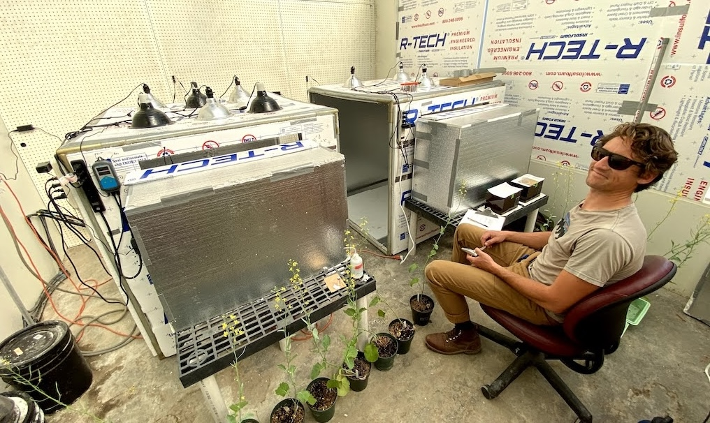
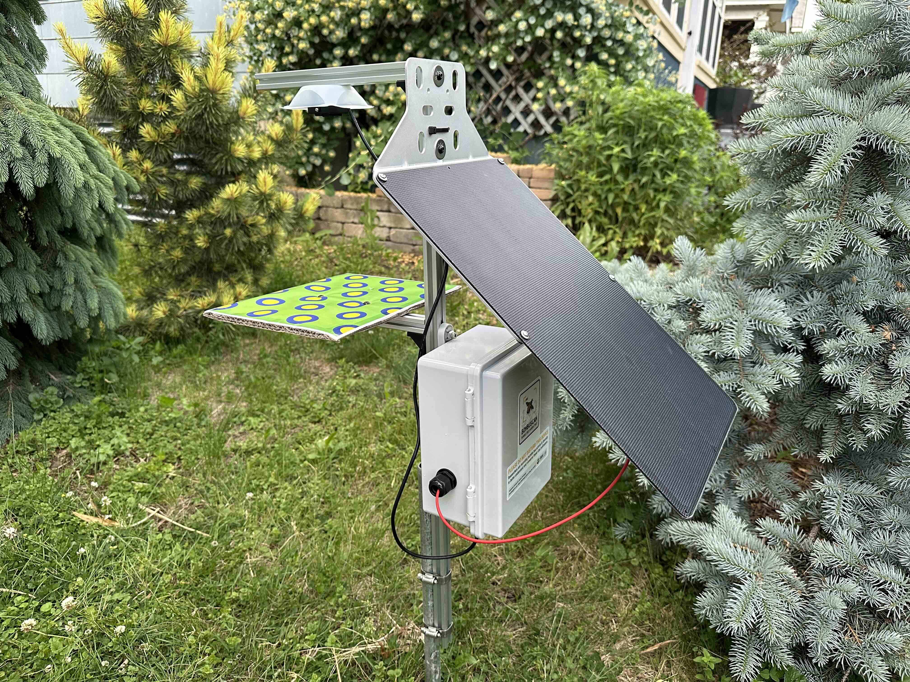
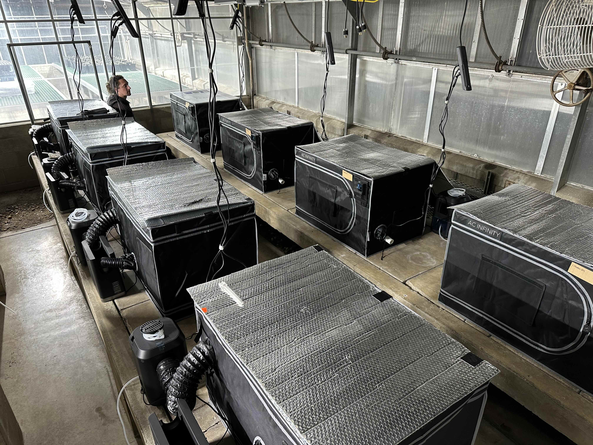
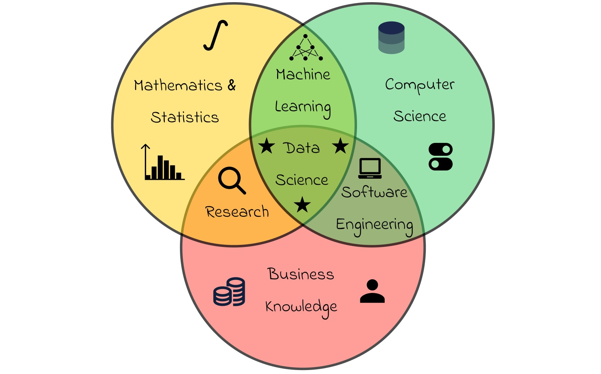
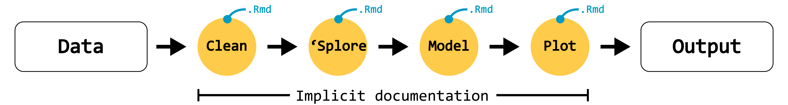
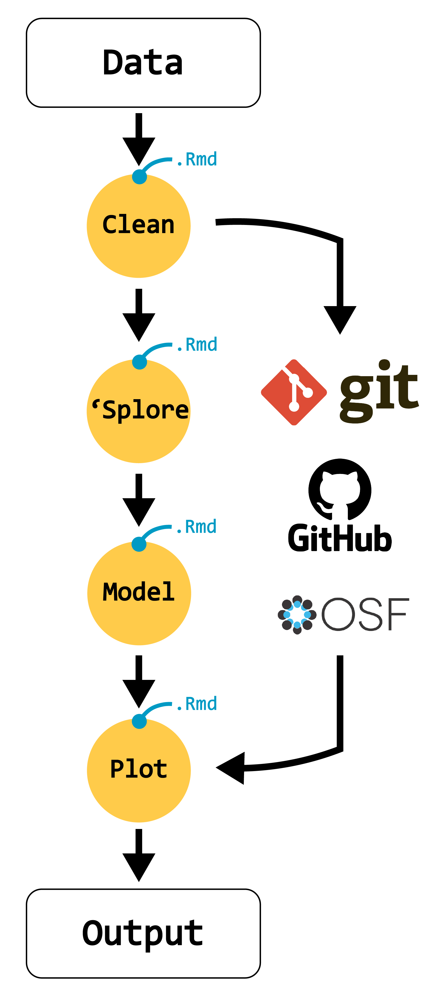

# Welcome!

## What we'll cover this week {.smaller}

. . .

::: box-1-list
[]{.margin-1} Who am I?
:::

. . .

::: box-2-list
[]{.margin-1} Course logistics and learning objectives
:::

. . .

::: box-3-list
[]{.margin-1} Course survey
:::

. . .

::: box-4-list
[]{.margin-1} What is data science?
:::

. . .

::: box-5-list
[]{.margin-1} Reproducibility crisis
:::

. . . 

::: box-6-list
[]{.margin-1} The data life cycle, and being FAIR
:::

#  Who am I? {.bkrd-color-1}

## Jeremy Hemberger, PhD {.smaller}

***Assistant Professor - Department of Entomology***     👨🏻‍🔬 I lead the [Insect Biodiversity under Global Change lab](https://jhemberger.github.io/ibug_lab_website/)  🐝 Research: global change impacts on insects  👨🏻‍🏫 Teaching: quantitative methods in ecology and entomology 

:::::: columns
::: {.column width="33%"}
{.absolute .rnd-img width="300" height="200"}
:::

::: {.column width="33%"}
{.absolute .rnd-img height="200"}
:::

::: {.column width="33%"}
{.absolute .rnd-img width="300" height="200"}
:::
::::::

## Jeremy Hemberger, PhD {.smaller}

***Assistant Professor - Department of Entomology***     🏫 Office location: 408 Hodson   🕥 Office hours: 8:00-12:00 Mondays (in person)

#  Course logistics and learning objectives {.bkrd-color-2}

#  Course survey {.bkrd-color-3}

#  What is data science? {.bkrd-color-4}

## Wrangling chaos 

:::{.center-xy}
{.rnd-img fig-align="center" width="1000"}
:::

## Wrangling chaos 

:::{.center-xy}

:::

## Wrangling chaos 
::: box-4-list
There's no one single definition of [data science]{.highlight-tomato}, but a broad definition that we can use here is *a field of study that uses scientific methods, processes, and systems to extract knowledge and insights from data*
:::

. . . 

{.rnd-img fig-align="center" width="60%"}

## Data science ≠ statistics
. . . 

[Statistics]{.highlight-tomato} uses data you have collected to quantify uncertainty and establish relationships. 

::: indented-text
<i class="fa-solid fa-turn-up fa-rotate-90"></i> *Artisan baker*: exact recipe, understanding the why and trying to identify the mechanism of observed changes in data. **Inference driven**
:::

. . . 

[Data science]{.highlight-tomato} tries to build systems to extract knowledge and insights from structured and unstructured data we have not yet seen. 

::: indented-text
<i class="fa-solid fa-turn-up fa-rotate-90"></i> *Bread factory*: we don't care about the recipe, we want the final prediction to be the most accurate. **Prediction driven**
:::

. . . 

::: {.callout-important}
Data science could not exist without statistics! The math under the hood of all data science is derived from statistical theory.
:::

## How we'll use data science in this class
::: box-4-list
Our goal is not to learn statistics or how to extract meaning from data here. Rather, *our goal is to learn the tools, tricks, and best practices of data science to make our work **efficient**, **robust**, and **reproducible***
:::

#  Reproducibility crisis {.bkrd-color-5}

## Biology and ecology have an issue with reproducibility
::: box-5-list
Conducting experiments in highly variable natural field conditions reduces our capacity to truly "replicate" or "reproduce" our science relative to other biological disciplines that work under more controlled conditions.
:::

. . . 

::: indented-text
<i class="fa-solid fa-turn-up fa-rotate-90"></i> In many ways, this is an un-solvable consequence of studying the natural world. It's basically impossible to directly replicate experiments or studies, but we can conceptually replicate.
:::

. . . 

::: indented-text
<i class="fa-solid fa-turn-up fa-rotate-90"></i> This makes increasing the replicability of the aspects we can control (experiment pre-registration, open data, publishing code, data management, etc.) [critically]{.highlight-tomato} important!
:::

. . . 

::: {.center-x}
**This is what this course is all about!**
:::

## Working with data has historically been the most opaque

. . .

::: box-5-list
Until the decade, the management, wrangling, analysis, and presentation of experimental or observational data has been the least reproducible/documented part of the science we do
:::

. . .

::: indented-text
<i class="fa-solid fa-turn-up fa-rotate-90"></i> The details of *how* we did our experiments was often the focus of our published methods. Even today that's still the case, even though many aspects of the experimental conditions in natural settings are totally outside of our control. 
:::

## Point 'n click vs. writing code

. . . 

{.rnd-img fig-align="center" width="100%"}

. . . 

{.rnd-img fig-align="center" width="100%"}

##
:::::: columns
::: {.column width="50%"}
{.rnd-img fig-align="center" height="550"}
:::

::: {.column width="50%"}
### We'll be learning tools and concepts that enable us to establish repeatable, rules-based workflows that ensure anyone who gets access to our data/code will be able to arrive at the same output/answer.
:::
::::::

#  The data life cycle and being FAIR {.bkrd-color-6}

## The data life cycle

