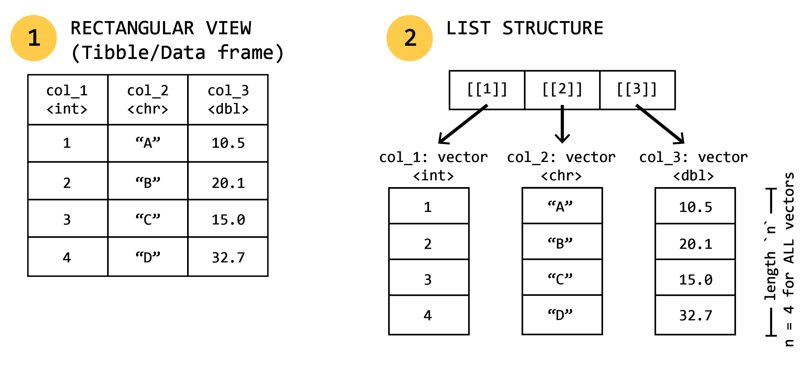

## Readings
-    [R for Data Science (2e) was written by Hadley Wickham, Mine Çetinkaya-Rundel, and Garrett Grolemund. Chapter 2: Workflow: Basics](https://r4ds.hadley.nz/workflow-basics.html)
-    [R for Data Science (2e) was written by Hadley Wickham, Mine Çetinkaya-Rundel, and Garrett Grolemund. Chapter 4: Workflow: Code Style](https://r4ds.hadley.nz/workflow-style.html)

## Questions we'll address this week
1. What are the atomic data types in R? 
2. How do we create and access data in the fundamental R objects?
3. How should we style our code for maximal readability and accessibility?

## Tour de Objects 🚴 🚴 🚴💨
As we discussed last week, programming in R is all about creating, maniupulating, and operating on [objects]{.highlight-tomato}. 

### The atomic data types 
R has 6 basic ("atomic") vector types, but 4 are most commonly used:

| Type | Description | Examples |
| :--- | :--- | :--- |
| **Logical** | Boolean values (`TRUE` / `FALSE`) | `TRUE`, `FALSE`, `T`, `F` |
| **Numeric (Double)** | Real numbers (default numeric type) | `3.14`, `42.0` |
| **Numeric (Integer)** | Whole numbers (designated with `L`) | `42L` |
| **Character** | Text strings | `"hello"`, `"camera trap"` |
| **Complex / Raw** | Imaginary numbers or raw bytes (rare) | `1 + 4i`, `charToRaw("A")` |

::: {.callout-tip}
## Type Checking
Use `typeof()` to check an object's underlying storage type, and `is.*` functions (e.g., `is.numeric()`, `is.character()`) to test for specific types.
:::

```{r}
#| label: atomic-types

# Create atomic variables
my_numeric   <- 42.5
my_integer   <- 42L
my_character <- "iBUG Lab"
my_logical   <- TRUE

# Check types
typeof(my_numeric)
typeof(my_integer)
is.numeric(my_character)
```

### Vectors
A vector is a 1-dimensional collection of elements of the same *type* (that is, all numeric, character, etc.). We create vectors using the `c()` function which *combines* or *concatenates* elements.

* Mixing data types in R will perform *implicit coercion*, which basically means it will convert everything into the most flexible type. The flexibility of objects in R from most to least is: `character > double > integer > logical`.
* In R, many functions or operations are *vectorized*, meaning they will apply math/functions/operations to every element of the vector automatically

```{r}
#| label: vectors
# Creating a numeric vector
my_counts <- c(12, 4, 30, 0)

# Vectorized maths
my_counts_doubled <- my_counts * 2
my_counts_doubled

# Coercion of data: what do you think this will be converted to?
messy_vector <- c(1, "shikaka", TRUE)
typeof(messy_vector)
```
### Lists
Lists are very much like vectors, but they can hold *different data types* (including things like other lists). You can essentially put anything into them and retain its native data type. 

* Created using `list()`
* We access elements using single brackets `[]` (which returns a sub-list) or double brackets `[[]]` or `$` (which extracts the actual object, e.g., another list, character, or vector). 

```{r}
#| label: lists
# Creating a list
camera_traps <- list(
  site_id = "SITE-01",
  active = TRUE,
  battery = 88.5,
  target_species = c("affinis", "auricomus", "impatiens")
)

# Exctracting/accessing elements
camera_traps$site_id
camera_traps[[4]][1] # list element 4, object 1 (i.e., first target species)

```

### Data frames and tibbles
Most of us will work with data frames 90% of the time. Tabular data, that is, a standard excel or Google Sheets file, arranged in a two-dimensional grid of rows and columns, is what most of us are familiar using to aggregate data from experiments and observational studies. When we bring these data into R, we'll bring them in as *data frames*. At their core, data frames are essentially lists (each list is a "column") of equal-length vectors (each vector element is a "row").

{width="100%"}

#### Accessing data in data frames
Because data frames are essentially lists, the manner in which we access data is very similar. We'll discuss more advanced/modern ways to access data in the coming weeks, but the base R ways to get at data are:

* **Extract column:** 
  * By name:`my_df$col_1` or `my_df[, "col_1"]` or `my_df[["col_1"]]`
  * By index: `my_df[, 1]` or `my_df[[1]]`
* **Extract row:**
  * `my_df[1, ]` (extracts row 1 across all columns)
* **Extract cell:**
  * `my_df[1, "col_1"]` or `my_df[1, 1]`
* **Extract range:** 
  * `my_df[1:5, c("col_1", "col_2")]`

#### Ok, got data frames ✅, what the hell is a tibble?
Great question! A tibble is a type of data frame. But a data frame is not necessarily a tibble! Tibbles are a special type of data frame that belong to the Tidyverse: a series of R packages and a philosophy of data organization and presentation. The developers describe them as:
> "Tibbles are data.frames that are lazy and surly: they do less (i.e. they don’t change variable names or types, and don’t do partial matching) and complain more (e.g. when a variable does not exist). This forces you to confront problems earlier, typically leading to cleaner, more expressive code. Tibbles also have an enhanced print() method which makes them easier to use with large datasets containing complex objects."

The visualization capacity alone makes them worth using, and they play nicely with all of the other tidyverse packages that we'll be using throughout this semester. Here are the big advantages of tibbles:

1.  **No unintended vector dropping (`drop = FALSE` by default):**
When subsetting a single column in a standard `data.frame`, base R silently simplifies the output into a 1D vector. A `tibble` always returns a 2D tibble unless explicitly told otherwise, preventing downstream code breakage in functions expecting tabular data.

    ```{r eval=FALSE}
    library(tibble)

    # Base Data Frame
    df <- data.frame(a = 1:3, b = c("x", "y", "z"))
    class(df[, "a"]) 
    # [1] "integer"  <-- Automatically dropped to a vector!

    # Tibble
    tbl <- tibble(a = 1:3, b = c("x", "y", "z"))
    class(tbl[, "a"]) 
    # [1] "tbl_df" "tbl" "data.frame"  <-- Remains a 1-column tibble!
    ```

2.  **No partial name matching:**
Base data frames try to guess column names if you make a typo or use shorthand. Tibbles require exact column matching and trigger a warning if a column doesn't exist, preventing silent logical errors.

    ```{r eval=FALSE}
    # Base Data Frame (Silently matches "species_name" via "$spec")
    df <- data.frame(species_name = c("affinis", "impatiens"))
    df$spec
    # [1] "affinis" "impatiens"  <-- Dangerous!

    # Tibble
    tbl <- tibble(species_name = c("affinis", "impatiens"))
    tbl$spec
    # NULL
    # Warning message: Unknown or uninitialised column: `spec`.
    ```

3.  **Better printing for large datasets:**
Printing a large `data.frame`can easily overwhelm your screen by dumping thousands of rows and wrapping dozens of columns. Tibbles automatically truncate output to 10 rows, fit columns to your console width, displays data types for every column, and adds colored text to help elements stand out.

    ```{r}
    library(tibble)
    # Creating a large-ish dataset
    df_large  <- data.frame(id = 1:100, x = runif(100), y = rnorm(100))
    tbl_large <- as_tibble(df_large)

    # Printing base df floods the console with oodles of lines
    print(df_large) 

    # Printing tibble gives a clean, readable overview with data types (e.g., <int>, <dbl>)
    tbl_large
    ```

4.  **Better column construction:**
When creating a `tibble`, you can reference variables created earlier in the exact same call. Base `data.frame` throws an error if you attempt this.

    ```{r eval=FALSE}
    # Works in tibble
    tbl <- tibble(
      x = 1:5,
      y = x * 2  # References 'x' immediately
    )
    ```

### Functions
Functions are code objects that perform *operations* on some input (called *arguments*) and return some output. As we discussed last week, anything with some word followed by `()` is a function. R has thousands of built in functions, and packages that we install come with their own sets of functions. We can also create our own! In fact, we'll spend a whole chunk of a class on this topic as knowing how to do this can save you a ton of time and make fewer mistakes than simply copying and pasting code over and over again. 

As a quick example, we can create a function to calculate the rate at which we capture images of insects in a camera trap:

```{r}
#| label: functions

# Defining our functions name and what it does
calculate_trap_rate <- function(image_count, days_active) {
  rate <- image_count / days_active
  return(rate)
}

# Using the function
calculate_trap_rate(image_count = 142, days_active = 7)
```

## Code Style 💃
Style is important. But unlike in life, having your "own" style when coding, is not necessarily something to strive for. In this space, style means having code formatting that is predictable and readable. To quote R4DS again...
>"Good coding style is like correct punctuation: you can manage without it, butitsuremaesthingseasiertoread."

It isn't just a tedious exercise to make everything line up and look "pretty". It legitimately helps both you and others be able to more quickly assess what your code is doing, and spot potential errors. remember, code is instruction to a an extremely inflexible, ridgid computer: they don't like messy, confusing, and imprescise instructions! There is an implied contract between you and the computer: R will do the crap you don't want to do provided that you are precise in your instructions.

### Naming files, objects
In R, object names *must* start with a letter and can only contain letters, numbers, `_`, and `.`. Object names should be descriptive and have some internal logic, and you'll need to figure out how you want to deal with multiple words. There are several methods:

1. **Snake case**: `i_use_snake_case`
2. **Camel case**: `iUseCamelCase`
3. **Period case**: `period.case`
4. **Chaos case**: `You.DO_you` <-- Resist entropy. Don't do this. 

Personally, I use a split convention. I use period case to name assigned R objects that are saved in the environment. For column names in tibbles/data frames, I use snake case. 

Another thing you'll need to do is be *concise* in your naming. The longer the object name is, the more keystrokes you need to enter to access/reference to it (increasing chances of mistakes and it's just annoying to have to type that much). That said, it's better to have a longer, more descriptive name than an extremely short, easy to type one. Ultimately, you'll save more time typing a longer name than searching your code for what `thing.2` is. In the event you have many different objects that are variations on a theme, it's better to distinguish them using a common prefix rather than a suffix as autocomplete works most efficiently that way. For example, `spp.model.1.glm` and `spp.model.2.glm`

There's a million ways to figure out a naming convention that works for you, but the most important part is to be consistent in your application. I do use suffixes for common object types in R so that I can easily tell what they are from the name:

| Object Type | Suffix | Examples |
| :--- | :--- | :--- |
| Data frame/tibble | `.df` | `mydata.df` |
| List | `.list` | `mylist.list` | 
| Models | `.lm`, `.glm`, `.glmm`, `.gam` | `model1.gam` |

#### Reserved words 🤐
When naming things, there are a few no-no words that you cannot use because R reserves them for specific uses. 

| Word / Symbol | Category | Description |
| :--- | :--- | :--- |
| `if` | Control Flow | Executes code conditionally |
| `else` | Control Flow | Alternate execution branch for `if` |
| `for` | Control Flow | Loop over a collection or vector |
| `while` | Control Flow | Loop while a condition is true |
| `repeat` | Control Flow | Infinite loop (requires `break` to exit) |
| `in` | Control Flow | Used within `for` loops to specify sequence iteration |
| `break` | Control Flow | Exits a loop immediately |
| `next` | Control Flow | Skips the rest of the current loop iteration |
| `function` | Definition | Defines a custom function |
| `TRUE` | Constant | Logical true value |
| `FALSE` | Constant | Logical false value |
| `NULL` | Constant | Represents an empty object or absent value |
| `NA` | Constant | Represents missing or unavailable data |
| `Inf` | Constant | Positive infinity |
| `-Inf` | Constant | Negative infinity |
| `NaN` | Constant | "Not a Number" (e.g., $0/0$) |

### Spaces
Spaces are good! Spaces are your friend! White space, as it's called (harkening back to the days of typewriters), helps our eyes to more quickly assess what is happening in code. We should put spaces on either side of mathematical operators (except exponentiation `^`) and around the assignment operator `<-`. Also put spaces after commas, just like we would writing. You can also add spaces to improve code alignment: this makes it easier to digest/skim quickly.

```{r eval=FALSE}
# Good spacing style
z <- (a + b)^4 / d

# Bad spacing style
z<-( a + b )^4/d

# Spaces after commas!
mean(x, na.rm = TRUE)

# Spaces for alignment
flights |> 
  mutate(
    speed     = distance / air_time,
    dep_hour  = dep_time %/% 100,
    dep_min   = dep_time %% 100
  )
```

### Pipes
We will talk more about pipes when we get into data wranglin' in a couple of weeks, but pipes are a great way to streamline your code and avoid creating intermediate objects that clutter your environment and take up memory. Briefly, a pipe takes stuff on its left and passes it along to the function on its right. So, `x |> f(y)` is equivalent to `f(x, y)` and `x |> f(y) |> g(z)` is equivalent to `g(f(x, y), z)`. In english, pipes basically translate to "then". The point of introducing them here is to discuss how to *style* the code you write using pipes, not to get into their use per se. 

Pipes should always have a space before them, and be the last thing on a line. This makes it easier to re-shuffle how things are ordered and quickly see the logic of a set of piped functions. 

```{r eval=FALSE}
# Strive for 
flights |>  
  filter(!is.na(arr_delay), !is.na(tailnum)) |> 
  count(dest)

# Avoid
flights|>filter(!is.na(arr_delay), !is.na(tailnum))|>count(dest)
```

If the function you're piping into has named arguments (e.g., `mutate()` or `summarize()`) put each argument on a new line. If it doesn't (e.g., `filter()`), keep it on one line unless you can't fit it all. 

```{r eval=FALSE}
# Strive for 
flights |>  
  group_by(tailnum) |> 
  summarize(
    delay = mean(arr_delay, na.rm = TRUE),
    n = n()
  )

# Avoid
flights|>
  group_by(tailnum) |> 
  summarize(
             delay = mean(arr_delay, na.rm = TRUE), 
             n = n()
           )

# Avoid
flights|>
  group_by(tailnum) |> 
  summarize(
  delay = mean(arr_delay, na.rm = TRUE), 
  n = n()
  )
```

### Comments and code outline (via `.qmd`)
One key area to keep style and organization in mind is how you structure your scripts/markdown files from a meta-level. Rather than a bunch of jumbled code that flows endlessly for 500 lines, use hierarchical markdown structure or sectioning comments to delineate or break up your file into cohesive/logical pieces. Look at the [frontmatter](#frontmatter-‼️) to download the template `.qmd` file that I use for all new notebooks.

```{r}
# 📦 LOAD PACKAGES

# 💾 LOAD DATA
## Tabular data

## Spatial data

# 🧹 CLEAN DATA
## Dataset 1

## Dataset 2

# 🏗️ BUILD MODELS
## Abundance models

## Spatial models

# 📈 VISUALIZE RESULTS
## Abundance models

## Spatial models
```
